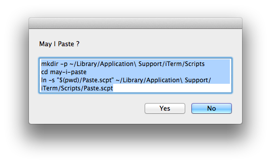

may-i-paste
===========

iTerm などで、ペーストする際に「改行」が含まれていたら確認ダイアログを表示する Applescript です。



## セットアップ方法
ちょっとめんどくさいです。

1. 適当なディレクトリで git clone

   ```
git clone git@github.com:harasou/may-i-paste.git
```

1. iTerm の Script ディレクトリ配下に設置

   ```
mkdir -p ~/Library/Application\ Support/iTerm/Scripts
cd may-i-paste
ln -s "$(pwd)/Paste.scpt" ~/Library/Application\ Support/iTerm/Scripts/Paste.scpt
# cp でも OK
```

1. iTerm のメニュー「Script」から Refresh を選択(Scriptメニューがない場合は、iTerm2 を再起動する)
   Refresh すると Script メニューの中に「Paste.scpt」が表示される。

1. システム環境設定から iTerm のショートカットを登録
   1. システム環境設定　▶︎　キーボード　▶︎　ショートカット
   2. `アプリケーション` を選択し、`＋` をクリック。
   3. 以下の値で、２つのショートカットを登録

       ```
       アプリケーション：iTerm
       メニュータイトル：Paste
       キーボードショートカット：⌘P
       ```
       ```
       アプリケーション：iTerm
       メニュータイトル：Paste.scpt
       キーボードショートカット：⌘V
       ```

## 使い方
`⌘V` するだけ。クリップボード内のテキストに「改行」が含まれていた場合は、確認のダイアログが表示されます。
「改行」がない場合は、そのまま貼付けられます。

## 補足
ダイアログを使用せずに貼付けたい場合は、`⌘P` を。
`Paste.scpt` を変更すれば、⌘P と ⌘V を入れ替えることも、他のショートカットも使うことができます。
